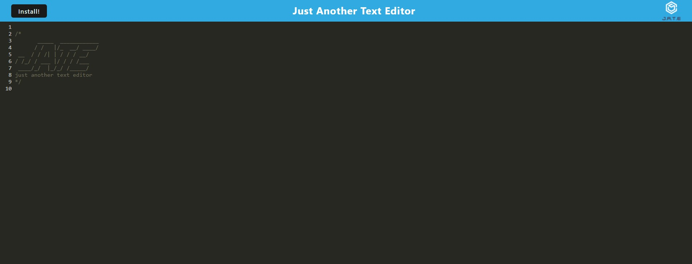
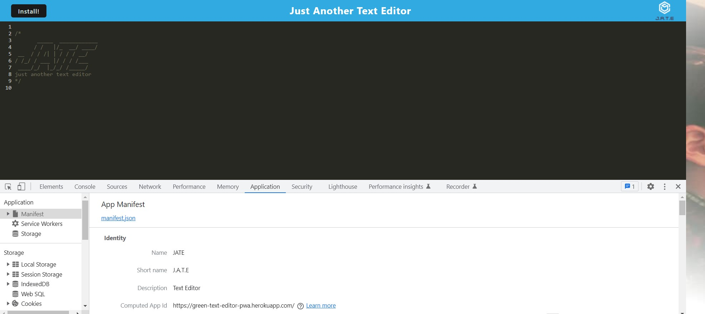
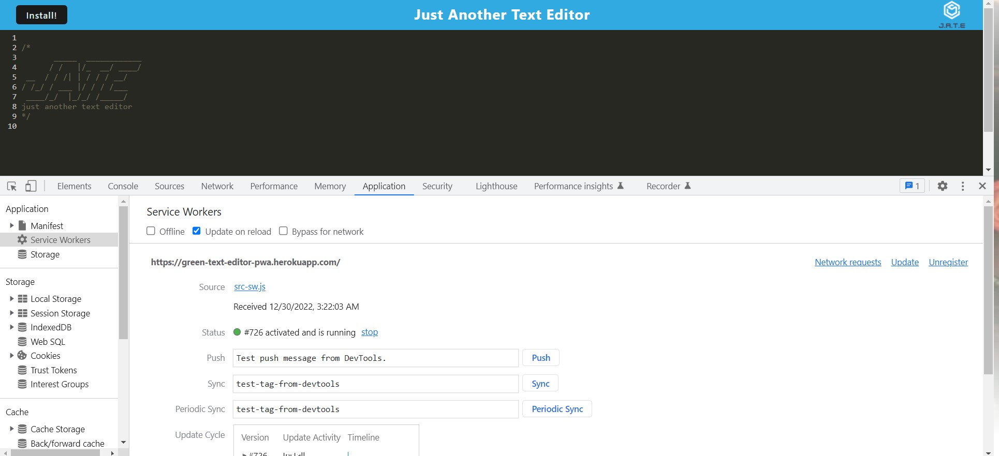
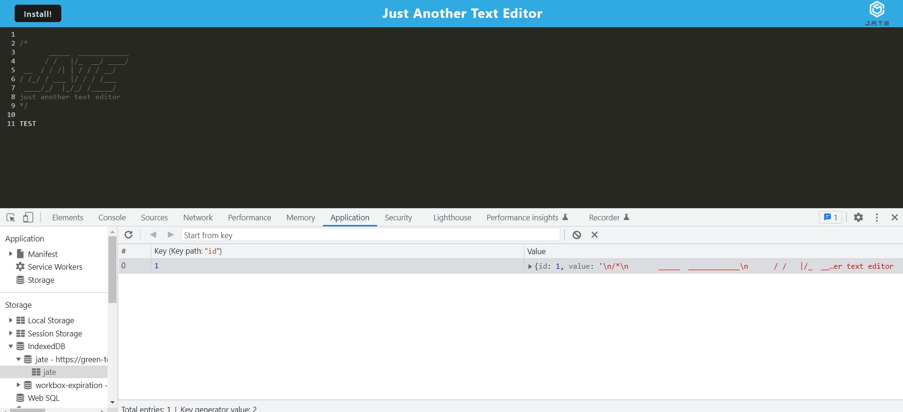

# green-text-editor-pwa

## Description
This project is to create a progressive web application text editor. This text editor application can be installed locally so it can be used online or offline. When a user types something and then clicks of the text field, the text will be saved. Several PWA technologies were used in this project. Such as webpack a static module bundler, workbox to make a service worker that caches static assets and indexedDB as the database.

## Table of contents
- [Mock-up](#Mock-up)
- [Installation](#Installation)
- [Usage](#Usage)
- [Contribution](#Contributing)
- [Questions](#Questions)
- [Diployment Links](#Questions)
## Mock-up

j.a.t.e.

manifest.json

service workers

indexedDB

## Installation
express

concurrently

nodemon
## Usage
npm install

npm run start

install link in app for *offline* use
## Contributing
Steven Green

## Questions
GitHub Username: [mrgreen12375](https://github.com/mrgreen12375)

Email Address: [ste2144105@gmail.com](ste2144105@gmail.com)
## Deployment Links
Heroku: https://green-text-editor-pwa.herokuapp.com/

GitHub Repo: https://github.com/mrgreen12375/green-text-editor-pwa